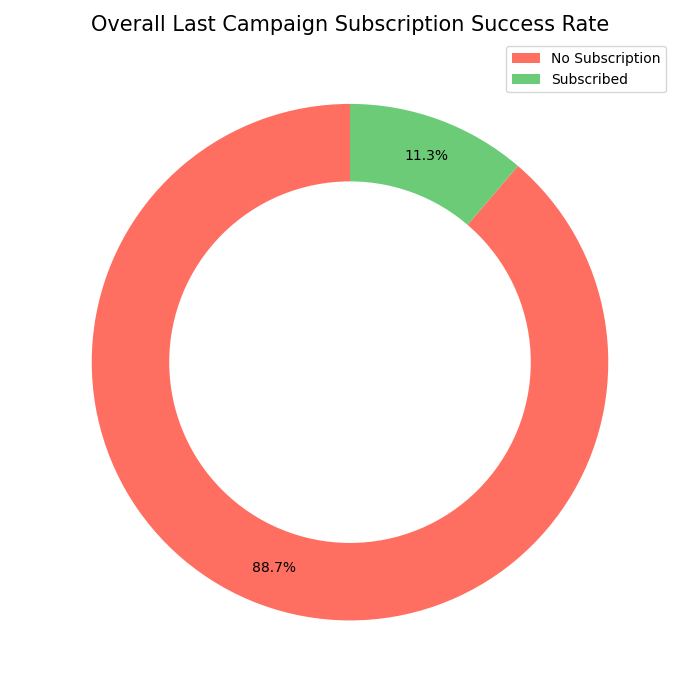
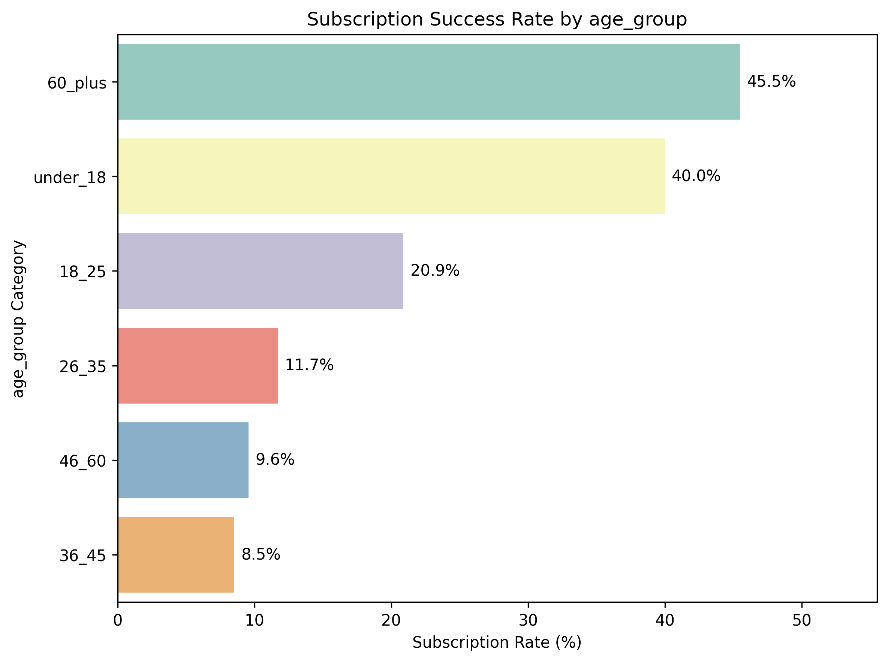
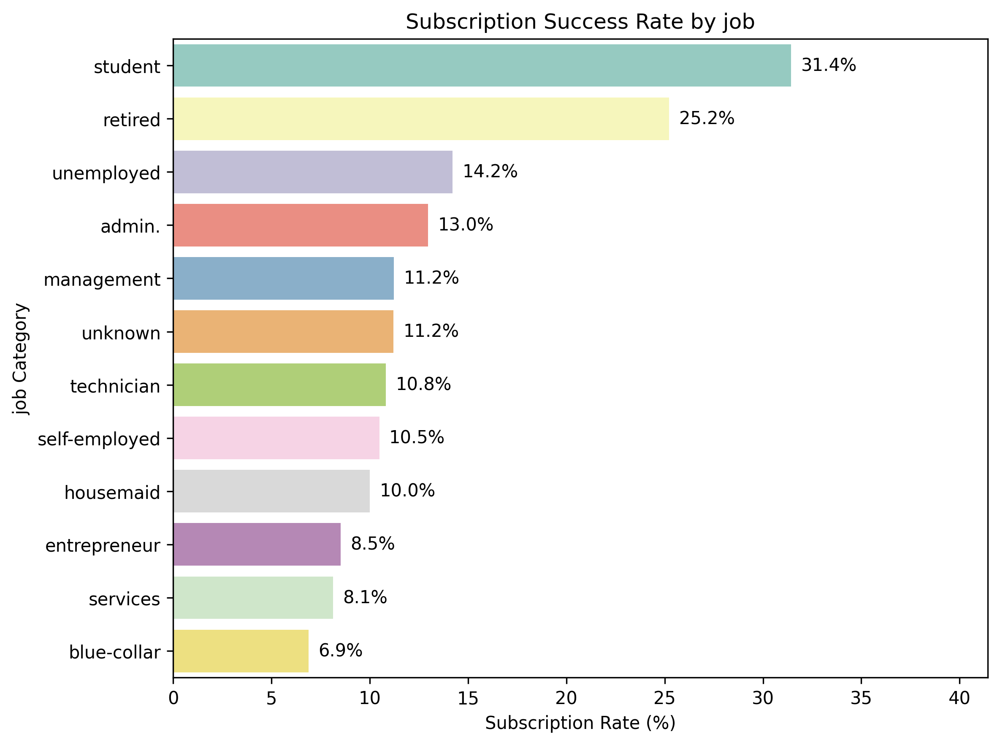

# 📊 Bank Marketing Campaign – EDA & Predictive Modeling

## 📌 Project Overview
This project analyzes a **bank direct marketing campaign dataset** to understand customer behavior, campaign effectiveness, and economic factors influencing **term deposit subscription**.

The project follows an **end-to-end data analytics and machine learning workflow**, including:
- Exploratory Data Analysis (EDA)
- Feature engineering
- Statistical insights
- Predictive modeling using **Logistic Regression**

The final goal is to identify **high-conversion customer segments** and build a **realistic prediction model** that can support data-driven marketing decisions.

---

## 🎯 Objectives
- Analyze customer demographics and financial attributes
- Evaluate campaign strategies (contact type, frequency, timing)
- Understand the impact of macroeconomic indicators
- Predict customer subscription likelihood (`y = 1`)
- Avoid data leakage and build models suitable for **real-time prediction**

---

## 📂 Dataset Description
The dataset contains information related to:
- **Customer profile**: age, job, education, marital status
- **Financial status**: housing loan, personal loan, credit default
- **Campaign data**: contact type, duration, number of contacts, previous outcomes
- **Economic indicators**: Euribor rate, employment variation, CPI, consumer confidence
- **Target variable**:  
  - `y = 1` → Customer subscribed  
  - `y = 0` → Customer did not subscribe  

---

## 🔍 Exploratory Data Analysis (EDA)
EDA was performed across four major dimensions:

### 1️⃣ Overall Campaign Performance

  

- Overall subscription success rate is **~11.3%**
- Majority of customers (**~88.7%**) did not subscribe
- Indicates need for improved targeting and segmentation

### 2️⃣ Customer Demographics

  
  

- Highest success rates observed for:
  - **Students**
  - **Retired customers**
  - **Age groups 18–25 and 60+**
- Largest customer volume comes from **26–45**, but conversion is moderate

### 3️⃣ Campaign Strategy Insights
- **Cellular contact** is nearly **3× more effective** than telephone
- Best performance with **1–3 contact attempts**
- Excessive contacts (10+) lead to diminishing returns
- **Thursday** shows the highest weekday conversion
- **March and December** show strong seasonal spikes

### 4️⃣ Economic Factors
- Low interest rate environments strongly boost subscriptions
- Lower employment levels correlate with higher term deposit uptake
- High consumer confidence significantly increases conversion rates

---

## 🧠 Feature Engineering
- Created categorical bins for continuous economic variables
- Converted binary target (`yes/no`) to numeric (`1/0`)
- Encoded categorical variables using one-hot encoding
- Carefully handled **data leakage** by evaluating models:
  - With `duration`
  - Without `duration` (realistic production scenario)

---

## 🤖 Predictive Modeling
### Model Used
- **Logistic Regression**

### Why Logistic Regression?
- Interpretable coefficients
- Strong baseline for binary classification
- Suitable for business decision-making

### Evaluation Metrics
- Accuracy
- Precision, Recall, F1-score
- ROC-AUC
- Confusion Matrix

### Model Performance (Without Duration)
- **Accuracy:** ~87%
- **ROC-AUC:** ~0.95
- Strong recall for subscribers (`y = 1`)
- Balanced trade-off between false positives and false negatives

---

## ⚠️ Data Leakage Note
> **Call duration is a strong predictor but causes data leakage**, as it is only known *after* a customer is contacted.  
> Therefore, models excluding `duration` were evaluated to ensure **real-time usability** in actual marketing systems.

---

## 📊 Key Insights
- High-volume segments are not always high-conversion segments
- Campaign strategy matters more than customer demographics alone
- Previous successful contacts are the strongest predictors of future success
- Economic conditions significantly influence customer decision-making

---

## 🛠️ Tools & Technologies
- Python
- Pandas, NumPy
- Matplotlib, Seaborn
- Scikit-learn
- Jupyter Notebook
- Git & GitHub

---

## 🚀 Business Value
This project demonstrates how analytics and machine learning can:
- Improve marketing ROI
- Reduce unnecessary customer outreach
- Identify high-potential customer segments
- Align campaigns with favorable economic conditions

---

## 👤 Author
**Your Name**  
Data Analyst Intern  
December 2025

---
